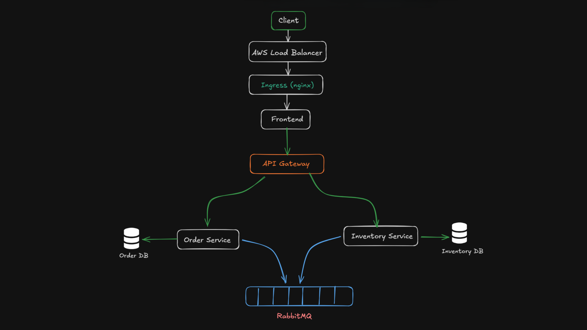

# Valerix - Resilient Microservices E-Commerce Platform

Valerix is a demonstration of a resilient, fault-tolerant microservices architecture designed to handle distributed system failures gracefully. It simulates a simplified e-commerce flow (Order -> Inventory) with built-in mechanisms for latency injection ("Gremlin"), timeout handling, asynchronous fallback messaging, and real-time visualization.

<!--  -->

## Architecture Overview

<!-- -->

<p align="center">
  
</p>

## Container Orchestration View

<!--

-->
<p align="center">
  
</p>


## 🏗 System Architecture

The system consists of independent services running in Docker containers, orchestrated via Docker Compose.

### Services
1.  **Frontend (React + Vite)**: A modern, dark-themed dashboard for placing orders, triggering failures, and visualizing system health and metrics.
2.  **API Gateway (Express + HTTP Proxy)**: The single entry point ensuring unified routing to backend services.
3.  **Order Service (Node.js + Express + Prisma)**: Manages order lifecycle. Handles synchronous communication with inventory and falls back to asynchronous messaging upon failure.
4.  **Inventory Service (Node.js + Express + Prisma)**: Manages product stock. Includes "Gremlin" logic to simulate high latency or unresponsiveness.
5.  **RabbitMQ**: Message broker for asynchronous order processing when synchronous calls fail.
6.  **PostgreSQL**: Dedicated databases for Order and Inventory services.
7.  **Monitoring Stack**: Prometheus (Metrics collection) and Grafana (Visualization).

---

## 🔄 Communication & Resilience Patterns

Valerix demonstrates how to solve common distributed system problems:

### 1. Synchronous vs. Asynchronous Fallback
*   **Happy Path**: The Order Service communicates **synchronously** (HTTP) with the Inventory Service to deduct stock immediately.
*   **The Problem**: If the Inventory Service is slow (high latency) or down, the user request standardly hangs or fails.
*   **The Solution**:
    *   The Order Service has a strict **Timeout (2s)** on the HTTP call.
    *   If the timeout is exceeded, it catches the error and switches to an **Asynchronous** path.
    *   The order details are published to a **RabbitMQ Queue** (`inventory_queue`).
    *   The Order status is immediately returned to the user as `QUEUED`, preventing a crash/hang.
    *   The Inventory Service consumes the message in the background, updates stock, and places a result on the `order_completion_queue`.
    *   The Frontend polls for the final status update.

### 2. Handling "Irresponsive" Services (Gremlin)
*   **The Problem**: Distributed services often hang rather than crash instantly.
*   **Simulation**: We use a "Gremlin" flag. When triggered from the frontend, the Inventory Service artificially delays its response by 5 seconds.
*   **Result**: Since the Order Service timeout is 2 seconds, this forces the system into the asynchronous fallback flows described above, demonstrating resilience against slow providers.

### 3. Server Down / Connection Retries
*   **The Problem**: Services might start in a different order or RabbitMQ might be temporarily unavailable.
*   **The Solution**: Both Order and Inventory services implement **Retry Logic** for connecting to RabbitMQ. They will attempt to connect indefinitely (or for a set period) until the broker is ready, ensuring the system self-heals on startup or connection loss.

### 4. Idempotency
*   **The Problem**: Retrying messages or duplicate requests can lead to double inventory deduction.
*   **The Solution**: The Inventory Service tracks processed `orderId`s in an `IdempotencyLog` table. Re-processing the same order ID immediately returns success without deducting stock again.

---

## 📊 Visualization & Monitoring

The system prioritizes observability:

*   **Real-time Alerts**: The Frontend Dashboard calculates the moving average latency of requests over a 30-second window. If latency spikes (e.g., due to Gremlin triggers), a visual **Red Alert** badge appears instantly.
*   **Status Indicators**: "Traffic Light" indicators show the health status (UP/DOWN) of individual services.
*   **Prometheus Metrics**: Each service exposes `/metrics` (RED method).
    *   `http_request_duration_seconds`: Track latency percentiles.
    *   `process_cpu_seconds`: Resource usage.
*   **Metrics Dashboard**: A dedicated view in the frontend parses raw Prometheus data to show CPU, Memory, Heap, and Uptime in a developer-friendly grid.

---

## 🚀 How to Run

1.  **Prerequisites**: Docker and Docker Compose installed.
2.  **Start System**:
    ```bash
    docker compose up -d --build
    ```
3.  **Access**:
    *   **Frontend**: `http://localhost:5173`
    *   **API Gateway**: `http://localhost:8080`
    *   **Grafana**: `http://localhost:3003` (Default login: `admin`/`admin`)

## 🧪 Testing the Resilience

1.  Open the Frontend.
2.  **Happy Path**: Click **"🚀 Place Normal Order"**.
    *   Result: Order Confirmed (~100ms). Green Latency indicator.
3.  **Resilience Test**: Click **"🐢 Trigger Gremlin"**.
    *   This sends `gremlin: true` to the backend.
    *   Inventory Service sleeps for 5s.
    *   Order Service times out after 2s.
    *   **Result**: UI shows **"QUEUED"** (Yellow).
    *   Background: RabbitMQ processes the order.
    *   Poll: After a few seconds, UI updates to **"Async Order Completed"**.
    *   **Alert**: The "Avg Latency" badge turns **RED** due to the spike.
